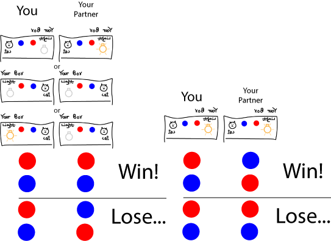

# Introducing the Quantum Casino

This is your physics playground to explore the strange world of quantum mechanics! Why a casino? Well, it turns out that the world behaves a lot like a game of poker. You know going into a casino that your chances of getting a royal flush are low. In fact, we can figure out exactly what those chances are for any given hand. Now, this isn't _exactly_ what quantum mechanics is doing, but we can start talking about the more nuanced points if we start from this analogy. For now, let me explain a little game to you.

## The Game

Like any game, there are things you can do (moves) and the condions for winning. Let's first talk about your "moves". We're giving you a box that which has a red button, a blue button, a cat, and a light. Ignore the cat for now (we're still working on training the cat to play the game when we tell it to.) The moves are simple: your light might be on or off. It doesn't matter if the light is on or off, you can choose to press either button. BUT, the light gives you a hint about whether you are choosing the correct button. How? Let's take a look at the conditions for winning our game:  What's going on here? First, focus on the lightbulbs: there are 4 cases. Your light is on, your partner’s light is on, both are on, or neither are on. Each of these cases is equally likely. Most of the time during the game, you’re going to care about the left column, because 3 out of 4 times, that’s how the lights will be.

## The Strategy

So, you already know that most of the time, you and your partner want to choose the same button. In fact, that’s exactly what you should do. Let’s say you and your partner choose a really boring strategy before you start the game: you’re both always going to choose red. Then, because the lights will turn on like the left column 3 out of 4 times, you’re almost guaranteed to win 3 times out of 4.

But remember the goal? It was to win more than 3 out of 4 times (or rather 6 out of 8, just to make it a bit more interesting). Is that possible? Can you and your partner decide ahead of time that you are going to use a strategy that will get you winning more than 6 times out of 8?

The sad answer is, no. You can’t. At least in terms of classical statistics. Play this game many many many many many … many times and you’ll never beat the 75% win rate. Sure, you might get lucky, but that luck won’t last.

## But what does winning mean?

A good question to ask is, “why should I care, especially if I’m not going to a casino based on quantum mechanics?” Turns out this little game is related to a very important result in quantum information.

I’m going to skip over a very lengthy mathematics interlude here, but for interested parties, I suggest these somewhat readable lecture notes or for the particularly daring, I suggest Chapter 2 Section 6 in Nielsen and Chuang’s textbook on Quantum Information.

An important word here is correlation. Roughly speaking, it’s a measure of how similarly two or more things behave. Say I saw a person and a dog on the street very far from me (so far that I wouldn’t be able to see a leash). If they’re moving together, it’s safe for me to say they’re probably connected in some way (like a leash). I can’t know for sure, but the evidence I have seems to suggest they are “correlated”.

This game tests your ability to correlate your choices with your partner’s choices. But...we didn’t let you talk to your partner during the game. So your choices aren’t actually correlated (like if there wasn’t a leash between the dog and the person). The question is whether you can trick someone into thinking the measurements are correlated.

The person to trick might be a bit...tricky, also, and change the rules on you; that’s where the lights come in. See, it would be easy to fool someone if you and your partner chose a pattern before. You could alternate every turn. Or worse, you could choose the same button every single time.

The way these slots work, you don't know how to win (that is you don't have all the information) until after you can't talk to your partner. So this game is designed to make you lose, and statistically speaking, it will. Unless you harness the power of quantum mechanics. The important quantum results are these:

*   “Classical” (that is, non-quantum) theories have to obey this 75% rule
*   “Quantum” theories can break this rule (and can even almost get to 85%)
*   There are ways of securely sharing information between two computers if we accept these quantum descriptions

That last part might have piqued your interest. Yes, this all does come back down to technology, and there’s good reason to believe that quantum computers will play an important role in the future. And while that’s cool and important and many people have already written about it, personally, I’m just happy playing with this little game. If you are interested in another, similar game, I recommend checking out Adam Becker's interactive webpage [here](https://freelanceastro.github.io/bell/). Just keep in mind that the house always wins!